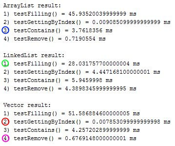
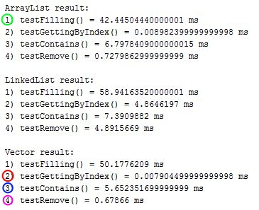
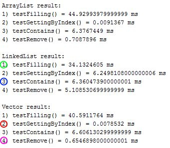

### ArrayList, LinkedList and Vector testing

**Tests description:** 
1. Adding 1 million objects. 
2. Getting an object by index from the middle of the list. 
3. Containing an object from the middle of the list. 
4. Removing an object from the middle of the list.

### First

### Second

### Third
